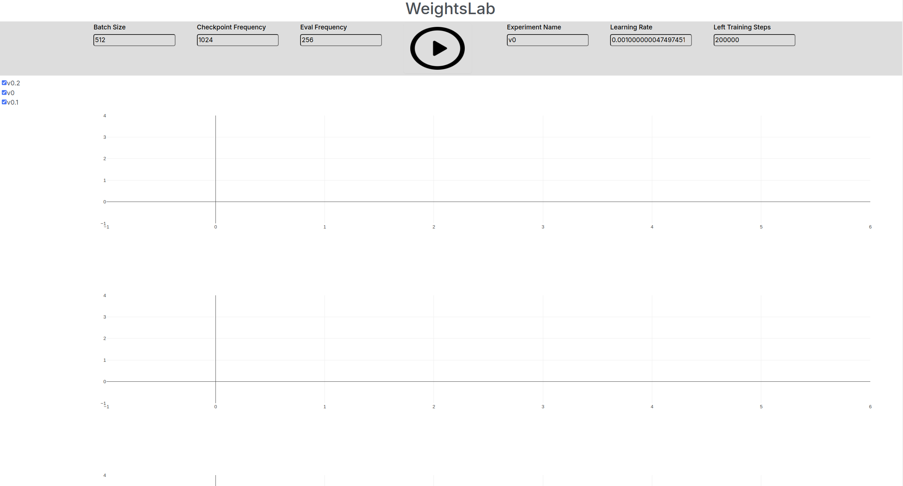

# WeightsLab UI onboarding steps
This is WeightsLab (or Graybox UI) an UI interface designed to allow AI
practitioners to have better control over the training process of
Deep Neural Networks training.

This a is early prototype of a solution that aims to DEBUG and FIX potential
problems that occurs during training:
* overfitting
* plauteous
* minority class misses
* problematic data samples analysis
* data set slicing
* weights manipulation (freezing, reinitalization)

Since the paradigm is about granular statistics and interactivity, this allows
for very useful and intersting flows to be performed:
* model minimization
* data set curation
* root cause analysis
* reduction in non-determinism

## Steps needed to get started
- [ ] Download the framework repo: git clone git@github.com:rotalex/graybox.git
- [ ] Install the framework: pip instal -e .
- [ ] Download the UI repo: git@github.com:GrayboxTech/weightslab_ui.git
- [ ] Compile rpc messages: python -m grpc_tools.protoc -I. --python_out=. --grpc_python_out=. experiment_service.proto
- [ ] Start the trainer process: python trainer_process.py
- [ ] Launch UI monitoring process: python weights_lab.py --root_directory=PATH_TO_ROOT_DIRECTORY_OF_EXPERIMENT
- [ ] Open link from terminal: '''   Dash is running on http://127.0.0.1:8050/ '''

### Initial page

### Short Demos

